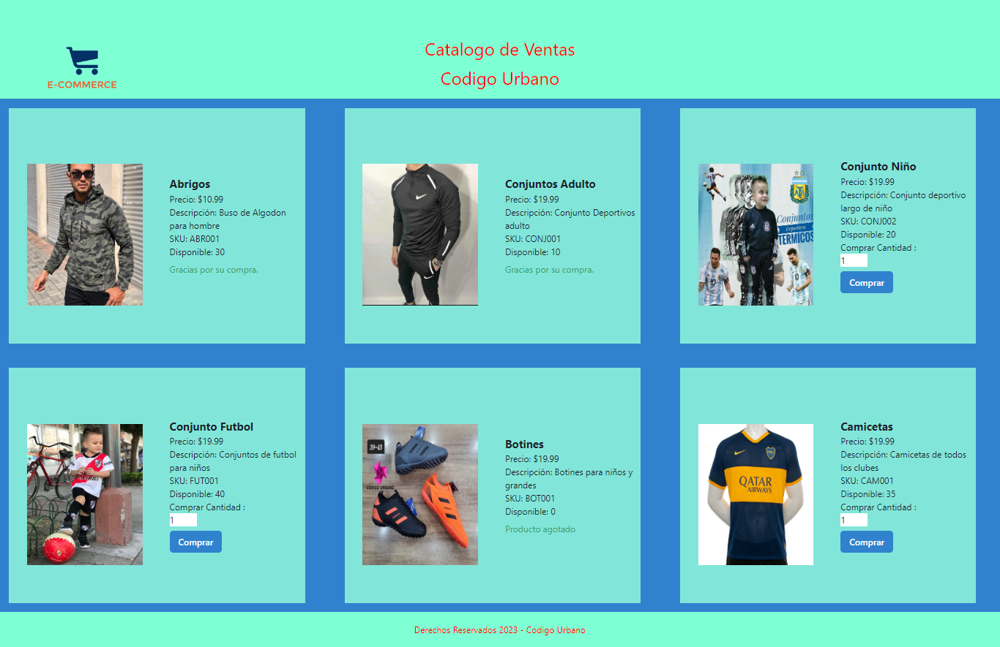

# Proyecto de Catálogo de Ventas

Este proyecto es parte de un trabajo realizado para la UTN en colaboración con "Argentina Programa". Consiste en el desarrollo del maquetado de una página de detalle de un producto para un sitio de ecommerce.

## Requisitos previos

Antes de clonar y ejecutar este proyecto, asegúrate de tener instalados los siguientes programas:

- Editor de código: Visual Studio Code (https://code.visualstudio.com/)
- Node.js: versión 12 o superior (https://nodejs.org/)
- React: biblioteca de JavaScript para construir interfaces de usuario (https://reactjs.org/)
- Chakra UI: biblioteca de componentes para React (https://chakra-ui.com/)
- Formik: biblioteca para la gestión de formularios en React (https://formik.org/)

## Clonar el proyecto

1. Abre tu terminal y navega hasta el directorio donde deseas clonar el proyecto.
2. Ejecuta el siguiente comando para clonar el repositorio:

git clone https://github.com/Gerardomedinav/Catalogo_ventas_react2.git

## Instalar dependencias

1. Navega hasta el directorio del proyecto clonado:

cd Catalogo_ventas_react2

2. Ejecuta el siguiente comando para instalar las dependencias del proyecto:

npm install

## Ejecutar el proyecto

1. Una vez que se hayan instalado todas las dependencias, ejecuta el siguiente comando para iniciar la aplicación:

npm start

2. La aplicación se abrirá automáticamente en tu navegador. Si no se abre, puedes acceder a ella en la siguiente URL: http://localhost:3000/

## Especificaciones del trabajo

El objetivo del trabajo es desarrollar el maquetado de una página de detalle de un producto para un sitio de ecommerce. La página debe mostrar los siguientes datos del producto:

- Nombre
- Descripción
- Precio
- SKU
- Cantidad disponible

Además, se debe agregar un botón "Comprar". Al hacer clic en dicho botón, se mostrará debajo del mismo un mensaje al usuario que diga "Gracias por su compra". Este comportamiento se debe resolver utilizando manejo de estados.

¡Gracias por tu interés en este proyecto! Si tienes alguna pregunta, no dudes en contactarnos.
